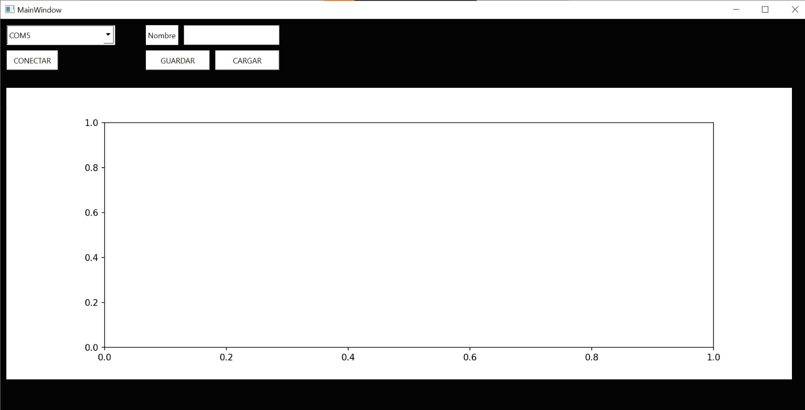
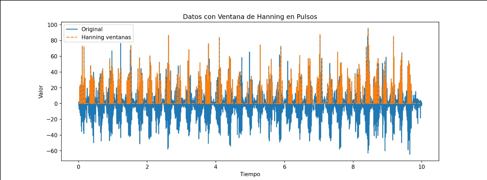
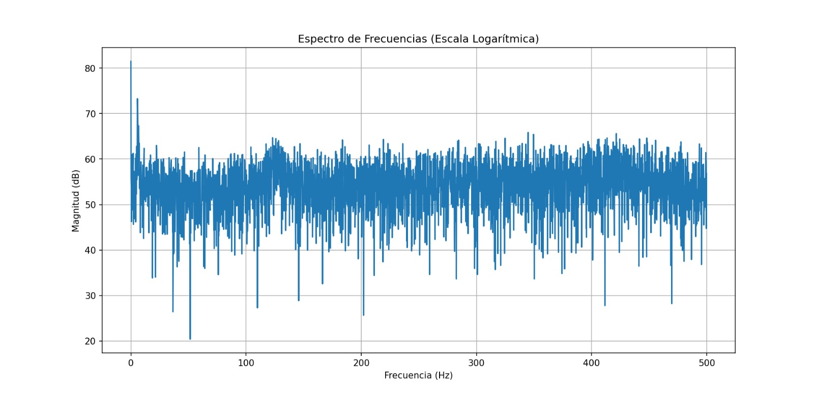
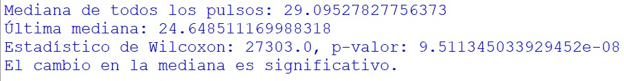

# Procesamiennto de una señal electromiografica
## Introducción
El laboratorio consistió en la elaboración de un código para el análisis de señales electromiográficas (EMG). Este código cuenta con varias secciones que aplican técnicas avanzadas como el uso de ventanas de Hanning, pruebas de hipótesis y el funcionamiento de interfaces que operan en tiempo real. Estas herramientas permiten procesar y analizar las señales capturadas durante 60 segundos de actividad en el antebrazo con enfasis en el musculo flexor superficial de la mano, facilitando su interpretación y el desarrollo de aplicaciones biomédicas.
### Adquisición de datos
Se utilizó un microcontrolador STM32 para adquirir los datos mediante un módulo ECG AD8232. El código implementado captura los datos y los empaqueta en bloques de 50 bytes (50B). Este programa opera utilizando un sistema operativo en tiempo real (RTOS) para la gestión eficiente de tareas en la STM32, lo que ayuda a evitar la congestión en la transmisión de datos. La configuración del sistema está diseñada para trabajar con una frecuencia de muestreo de 1000 Hz, garantizando un procesamiento continuo y en tiempo real de las señales electromiográficas.



La primera sección del código se encarga de controlar los parámetros de la interfaz diseñada para visualizar los datos y gestionar la conexión con el puerto serial, a través del cual se reciben los datos provenientes de la STM32. Al operar en tiempo real, la interfaz muestra los datos ya filtrados enviados por el microcontrolador. Además, incluye botones que permiten guardar y cargar las señales capturadas, aplicando la ventana de Hanning a los pulsos detectados, lo que mejora la visualización y el análisis de las señales electromiográficas.

```pyton
class principal(QMainWindow):

    # Creación del hilo para trabajo de adquisición de datos para trabajo en tiempo real
    def __init__(self):
        super(principal, self).__init__()
        uic.loadUi("ECGD.ui", self)
        self.puertos_disponibles()
        
        self.ser1 = None
        
        self.connect.clicked.connect(self.conectar)
        self.guardarButton.clicked.connect(self.guardar_datos)
        self.cargarButton.clicked.connect(self.cargar_y_mostrar_datos)

        self.x = np.linspace(0, 10, 6000)
        self.y = np.zeros(6000)  

        self.fig = Figure()
        self.ax = self.fig.add_subplot(111)
        self.canvas = FigureCanvas(self.fig)

        layout = QVBoxLayout()
        layout.addWidget(self.canvas)
        self.graficawidget.setLayout(layout)

        self.fm = 1000  # Frecuencia de muestreo

        # Frecuencias de corte
        self.fc_baja = 20  # Pasa altos
        self.fc_alta = 450  # Pasa bajos

        # Normalización de frecuencias de corte
        self.fn_baja = self.fc_baja / (0.5 * self.fm)
        self.fn_alta = self.fc_alta / (0.5 * self.fm)

        # Orden del filtro
        self.orden = 3

        # Filtro pasa banda
        self.b, self.a = butter(self.orden, [self.fn_baja, self.fn_alta], btype='bandpass', analog=False)

    # Determinación de los puertos para la detección de datos
    def puertos_disponibles(self):
        p = serial.tools.list_ports.comports()
        for port in p:
            self.puertos.addItem(port.device)

    # Conexion con el puerto
    def conectar(self): 
        estado = self.connect.text()
        self.stop_event_ser1 = threading.Event()
        if estado == "CONECTAR":
            com = self.puertos.currentText()
            try:
                self.ser1 = serial.Serial(com, 115200)
                self.hilo_ser1 = threading.Thread(target=self.periodic_thread1)
                self.hilo_ser1.start()
                print("Puerto serial 1 Conectado")
                self.connect.setText("DESCONECTAR")

            except serial.SerialException as e:
                print("Error en el puerto serial 1: ", e)
        else:
            self.ser1.close()
            self.stop_event_ser1.set()
            self.hilo_ser1.join()
            print("Puerto serial 1 Desconectado")
            self.connect.setText("CONECTAR")

    # Desempaquetado de datos de 50B
    def periodic_thread1(self):
        if self.ser1 is not None and self.ser1.is_open:
            data = self.ser1.read(50)
            if len(data) == 50:
                data = struct.unpack('50B', data)
                for i in range(0, len(data), 2):
                    self.y = np.roll(self.y, -1)
                    self.y[-1] = data[i] * 100 + data[i + 1]

                self.ax.clear()

                # Aplicar el filtro pasa banda
                df = filtfilt(self.b, self.a, self.y)

                # Graficar la señal filtrada
                self.ax.plot(self.x, df)
                self.ax.grid(True)
                self.canvas.draw()

        if not self.stop_event_ser1.is_set():
            threading.Timer(1e-3, self.periodic_thread1).start()

    def guardar_datos(self):
        try:
            now = datetime.datetime.now()
            fecha_hora = now.strftime("%Y-%m-%d %H:%M:%S")
            nombre_persona = self.nombre_persona.text()
            nombre_persona = nombre_persona.replace(":", "").replace(" ", "_")
            nombre_archivo = f"{nombre_persona}.txt"

            # Aplicar el filtro a la señal actual antes de guardarla
            df = filtfilt(self.b, self.a, self.y)

            # Guardar la señal filtrada en el archivo en .txt
            with open(nombre_archivo, 'w') as f:
                f.write(f"Fecha y hora: {fecha_hora}\n")
                f.write(f"Nombre del paciente: {nombre_persona}\n")
                f.write("Datos filtrados de la medición:\n")
                for i in range(len(self.x)):
                    f.write(f"{self.x[i]}, {df[i]}\n")

            print(f"Datos filtrados guardados en {nombre_archivo}")

        except Exception as e:
            print("Error al guardar los datos:", e)
            
    #Funcion principal para leer los datos del txt
    def cargar_datos(self, nombre_archivo):
        try:
            x = []
            y = []

            with open(nombre_archivo, 'r') as f:
                for _ in range(4):
                    next(f)

                for line in f:
                    datos = line.strip().split(",")
                    x.append(float(datos[0]))
                    y.append(float(datos[1]))
            return x, y

        except Exception as e:
            print("Error al cargar los datos:", e)
            return None, None
```
### Procesamiento de la señal 
Para empezar a procesar la señal lo primero que hay que hacer es detectar en que secciones hubo una pulsacion ya que la ventana requiere un inicio y un final por ende hay que determinarlos 
```pyton
def detectar_pulsos(self, señal, umbral):
        pulsos = []
        en_pulso = False
        inicio_pulso = 0

        for i in range(len(señal)):
            if señal[i] > umbral and not en_pulso:
                en_pulso = True
                inicio_pulso = i
            elif señal[i] < umbral and en_pulso:
                en_pulso = False
                fin_pulso = i
                pulsos.append((inicio_pulso, fin_pulso))
        
        return pulsos
```
Cuando se llama a esta función, se le envía la señal objetivo y un umbral para detectar los momentos en que hay una subida que indica el inicio de un pulso, así como su final. La función retorna un vector con los índices que marcan la posición de los pulsos, lo que permite aplicar las ventanas adecuadamente para el procesamiento de la señal.

```pyton
    def aplicar_ventana_hanning_por_pulsos(self, y, pulsos):
        
        señal_filtrada = np.zeros_like(y)
        
        for inicio, fin in pulsos:
            ventana_hanning = np.hanning(fin - inicio)
            señal_filtrada[inicio:fin] = y[inicio:fin] * ventana_hanning
        
        return señal_filtrada
```


Las ventanas de Hanning se aplican a los pulsos detectados para filtrar los valores en la sección central, eliminando aquellos que corresponden al ruido principal del sistema. Este proceso se realiza utilizando una función propia de numpy, optimizando así el filtrado de la señal electromiográfica.

```pyton
    def calcular_y_mostrar_fft(self, y_filtrada):
        # Calcular la Transformada de Fourier de la señal aventanada
        Y_fft = fft.fft(y_filtrada)
        
        # Crear el vector de frecuencias correspondiente
        N = len(y_filtrada)
        freqs = fft.fftfreq(N, 1 / self.fm)
        
        # Eliminar la parte negativa de la ventna
        Y_fft_magnitude = np.abs(Y_fft[:N // 2])
        freqs_pos = freqs[:N // 2]

        # Pasar a decibelios
        Y_fft_magnitude_db = 20 * np.log10(Y_fft_magnitude + 1e-10)

        
        # Graficar espectro
        fig_fft, ax_fft = plt.subplots()

        
        ax_fft.plot(freqs_pos, Y_fft_magnitude_db)
        ax_fft.set_xlabel('Frecuencia (Hz)')
        ax_fft.set_ylabel('Magnitud (dB)')
        ax_fft.set_title('Espectro de Frecuencias')
        ax_fft.grid(True)

        plt.show()
```


Una vez que la señal ha sido aventanada, se procede a aplicar la Transformada de Fourier a las ventanas, lo que permite obtener el espectro de frecuencias y continuar con el análisis estadístico. Aunque no siempre es evidente a simple vista, se puede observar una diferencia en la intensidad de los pulsos a medida que transcurre el tiempo.

```pyton
    def cargar_y_mostrar_datos(self):
        nombre_archivo, _ = QFileDialog.getOpenFileName(self, "Seleccionar archivo", "", "Archivos de texto (*.txt)")
        if nombre_archivo:
            x, y = self.cargar_datos(nombre_archivo)
            if x and y:
                self.x = x
                self.y = y

                # Pulsos
                umbral = 20 
                pulsos = self.detectar_pulsos(self.y, umbral)

                # Aplicar la ventana 
                y_filtrada = self.aplicar_ventana_hanning_por_pulsos(self.y, pulsos)

                # Limpiar la gráfica para eliminar los datos capturados 
                self.ax.clear()

                # Graficar la señal original
                self.ax.plot(self.x, self.y, label="Original")

                # Graficar las ventanas
                self.ax.plot(self.x, y_filtrada, label="Ventanas Hanning", linestyle="--")

                self.ax.set_xlabel('Tiempo')
                self.ax.set_ylabel('Valor')
                self.ax.set_title('Datos con Ventana de Hanning en Pulsos')
                self.ax.legend()

                # Refrescar el canvas para mostrar la gráfica
                self.canvas.draw()

                # Calcular y mostrar la Transformada de Fourier de la señal aventanada
                self.calcular_y_mostrar_fft(y_filtrada)

                # Calcular las medianas de los pulsos
                medianas = []
                for inicio, fin in pulsos:
                    pulso = y_filtrada[inicio:fin]
                    if len(pulso) > 0:  # Asegurarse de que hay datos en el pulso
                        medianas.append(np.median(pulso))

                # Obtener la última mediana
                if len(medianas) > 0:
                    ultima_mediana = medianas[-1]
                    # Calcular la media de las medianas
                    media_medianas = np.mean(medianas[:-1]) if len(medianas) > 1 else medianas[0]

                    # Aplicar la prueba de Wilcoxon
                    stat, p_value = stats.wilcoxon(medianas[:-1], [ultima_mediana]*len(medianas[:-1]))

                    # Mostrar resultados
                    print(f"Mediana de todos los pulsos: {media_medianas}")
                    print(f"Última mediana: {ultima_mediana}")
                    print(f"Estadístico de Wilcoxon: {stat}, p-valor: {p_value}")

                    # Interpretar el p-valor
                    alpha = 0.05
                    if p_value < alpha:
                        print("El cambio en la mediana es significativo.")
                    else:
                        print("El cambio en la mediana no es significativo.")
                else:
                    print("No se encontraron pulsos en la señal.")

```
Por último, esta sección del código muestra los valores en la interfaz y realiza el análisis estadístico. Para este análisis, se utilizó el test de Wilcoxon, que es adecuado para comparar dos muestras sin necesidad de parametrización. Este test fue empleado para comprobar la hipótesis de que, a medida que un músculo se utiliza, su fuerza disminuye debido a la fatiga. El objetivo es identificar diferencias significativas entre el promedio de las medianas de las ventanas y la mediana de la última ventana. En este caso, el test de Wilcoxon es apropiado debido a la relación que existe entre los datos, ya que permite evaluar la fuerza del músculo al inicio y al final de la prueba.

[Wilcoxon Pyton](https://docs.scipy.org/doc/scipy/reference/generated/scipy.stats.wilcoxon.html)

### Resultados y análisis
Al correr el código y cargar el archivo con los datos de la señal EMG, se obtuvieron los siguientes resultados en la consola:



La mediana promedio de todos los pulsos obtenidos fue de 29.10, mientras que la mediana de la última ventana fue de 24.65. Esto sugiere una reducción en los valores de la señal conforme avanzaba el tiempo. Por otro lado el p-valor obtenido fue 9.51e-08, que es significativamente menor que el nivel de significancia común del 5% (0.05). Esto indica que la diferencia entre la mediana promedio y la última mediana no es producto del azar, sino que es estadísticamente significativa.
### Conclusión
Dado el resultado del test de Wilcoxon y el bajo p-valor obtenido, podemos rechazar la hipótesis nula de que no hay diferencia entre las medianas. Esto apoya la hipótesis alternativa de que existe una disminución significativa en la señal EMG, lo que puede interpretarse como fatiga muscular.

El descenso en la mediana de la señal EMG podría estar relacionado con la disminución de la capacidad de generar fuerza muscular a medida que avanza la prueba, lo cual es consistente con lo que se esperaría en un contexto de fatiga muscular progresiva.
### Anexos

## Requisitos
- Pyton 3.9.0 ó superior
### Libreias:
- scipy
- struct
- PyQt6
- serial
- numpy
- datetime
- matplotlib
## Contacto 
est.julian.vergara@unimilitar.edu.co
